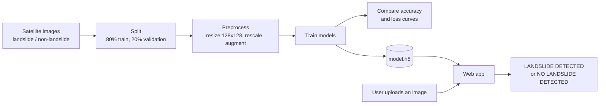
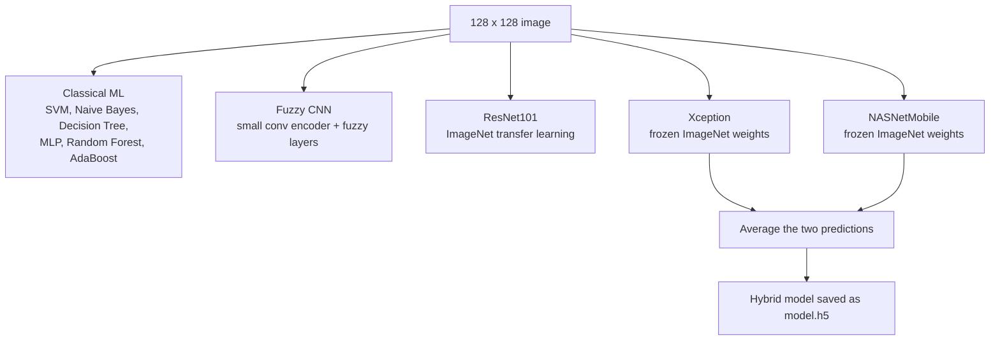

# Landslide Detection from Satellite Images

Upload a satellite image, click Predict, and the app tells you whether it shows a landslide: either **LAND-SLIDE DETECTED!** or **NO LAND-SLIDE DETECTED!**

Behind that page is a set of image classifiers trained on landslide and non-landslide satellite photos. The notebook trains and compares several of them, and the best-performing one is saved as `model.h5` for the web app to load. The project follows the ideas in the IEEE Access paper *Artificial Intelligence Techniques for Landslides Prediction Using Satellite Imagery* (2024), listed under References.

## Why bother

Landslides happen in hilly regions after heavy rain, earthquakes or construction on unstable slopes. The usual way to find affected areas is field surveys and manual inspection, which is slow and can't cover large regions. Satellite images already exist for those regions, and a landslide leaves visible marks: bare soil, missing vegetation, broken slopes. A CNN can learn to spot those marks, so this project tries to automate that first check.

## How it works



**Data.** Images sit in one folder per class. The `split-folders` package splits them 80/20 with a fixed seed (42), so the split is the same every run. Images are resized to 128 x 128, pixel values are scaled to 0-1, and the training set gets random shear and zoom to stretch a small dataset further.

**Models.** The notebook tries four different approaches on the same data:



- **Classical ML baselines** from scikit-learn, mainly to see how far simple models get.
- **Fuzzy CNN**, a small convolutional encoder followed by custom fuzzy and defuzzy layers.
- **ResNet101** with ImageNet weights and a new two-class output layer.
- **Hybrid**, Xception and NASNetMobile with frozen ImageNet weights, each with its own dense head. Their outputs are averaged into one prediction.

The deep models train for up to 50 epochs, with early stopping and learning-rate reduction when validation accuracy stalls. The notebook plots training and validation loss and accuracy for each one at the end.

## The web app

The page is titled "Advanced Landslide Detection". You pick an image, press Predict, and the uploaded image is shown back with the verdict underneath. JPG and PNG files are accepted.

<!-- Add 2 screenshots of your app here, e.g. one landslide result and one no-landslide result:


-->

## Running it

You need Python 3 and these packages:

```bash
pip install tensorflow scikit-learn pandas numpy scipy pillow matplotlib tqdm split-folders flask
```

To retrain, put your images in `data/`, one sub-folder per class, then run the notebook from top to bottom:

```bash
jupyter notebook
```

To start the web app:

```bash
python app.py
```

<!-- Check: is the app file really called app.py, and is it Flask? Change the line above and the pip line if not. -->

Open the address printed in the terminal (usually `http://127.0.0.1:5000`) and upload an image.

## Results

Accuracy and loss curves for every model are in the notebook.

<!-- Add your real numbers here: accuracy (and precision/recall if you have them) for each model on the validation set. -->

For context, the paper this project builds on reports about 96.9% accuracy using a modified ResNet101 on the Bijie landslide dataset. That is the paper's number, not a result of this project.

## Limits

- It only looks at the picture. Rainfall, soil moisture, slope and seismic activity all affect landslides and none of them are used here.
- It's a yes/no classifier. There is no risk level, no map, and no location of where the landslide is inside the image.
- Landslide images are usually far fewer than non-landslide ones, and a small or lopsided dataset limits how well any of these models generalise to new regions.
- This is a study project. Don't rely on it for real safety or early-warning decisions.

## Ideas for later

- Feed in terrain height (DEM), rainfall, soil and seismic data alongside the images
- Explain predictions with Grad-CAM or SHAP so it's clear what the model looked at
- Add risk levels and susceptibility maps instead of a single yes/no
- Pull in fresh satellite data automatically and show alerts on a dashboard

## References

- *Artificial Intelligence Techniques for Landslides Prediction Using Satellite Imagery*, IEEE Access, vol. 12, 2024. DOI: 10.1109/ACCESS.2024.3446037
- K. He et al., *Deep Residual Learning for Image Recognition*, CVPR 2016
- F. Chollet, *Xception: Deep Learning with Depthwise Separable Convolutions*, CVPR 2017
- B. Zoph et al., *Learning Transferable Architectures for Scalable Image Recognition*, CVPR 2018
